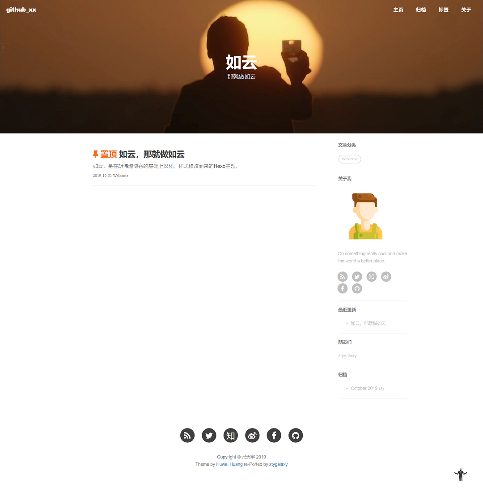

<p align="center">
	
</p>

##  如云 / hexo-theme-ruyun

一个Hexo个人博客主题。

基于[胡伟煌](http://www.huweihuang.com/)移植的[黄玄Jekyll博客主题](https://github.com/Huxpro/huxpro.github.io)修改而来。

我对它进行了一些调整，以便更适合我的口味。

### 🎨 修改

- **大道至简**：删除多处评论插件。
- **口味**：主页、文章样式的修改。
- **每天皆不同**：修改文章默认头图为每日必应壁纸。
- **传承**：主要内容的汉化。

### 🌈 效果
我的博客: [ztygalaxy](https://ztygalaxy.github.io)



### 🔨 用法

在`_config.yml`中配置个人信息。

#### 1. 替换Repo信息.

```yml
deploy:
  type: git
  repository: 你的Repo名称
  branch: master
  message: Update Content
```

#### 2. 客制化.

通过替换、修改`source/img/avatar/ironman.png`来配置头像。

或者修改它的路径：

```yml
sidebar: true    # 侧边栏开关.
sidebar-about-description: "你的个人描述"
sidebar-avatar: img/你的头像路径
```

在`widgets`下配置侧边栏的部件，使用`#`关闭。

```yml
widgets:
- featured-tags
- short-about
#- recent-posts
#- friends-blog
- archive
- category
```

钢铁侠的回到顶部，可在`css/image`中替换。

其他样式，可以在浏览器中检查元素到对应文件修改，例如`layout`文件夹下，它们的名字作用都很明了。

### 👦 相关

[胡伟煌的博客](http://www.huweihuang.com/)    [黄玄的博客]( http://huangxuan.me/ )    [张天宇的博客](https://ztygalaxy.github.io)

相关阅读：[Hexo是怎么工作的](http://coderunthings.com/2017/08/20/howhexoworks/)