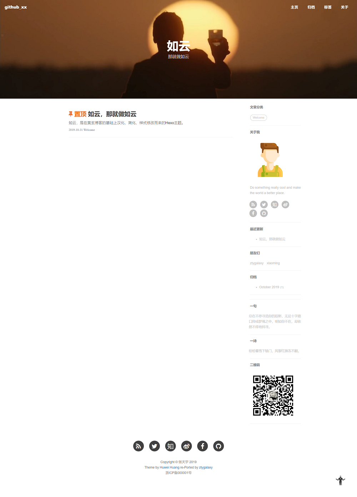

#  如云 / hexo-theme-ruyun
### 如云，一个Hexo的个人博客主题。

这个主题是基于[胡伟煌](http://www.huweihuang.com/)移植的[黄玄Jekyll博客主题](https://github.com/Huxpro/huxpro.github.io)修改而来。

我对它进行了汉化、删除了不必要的功能，并对主页样式进行了调整，以便更适合我的口味。

它的名字来自于成语高手如云。

### 效果
我的博客: [ztygalaxy](https://ztygalaxy.github.io)



### 用法

在_config.yml中配置你的个人信息。

#### 1. 替换Repo信息.

```yml
deploy:
  type: git
  repository: 你的Repo名称
  branch: master
  message: Update Content
```

#### 2. 客制化.

你可以通过替换、修改`source/img/avatar/ironman.png`来配置你的头像。

或者修改它的路径：

```yml
sidebar: true    # 侧边栏开关.
sidebar-about-description: "你的个人描述"
sidebar-avatar: img/你的头像路径
```

在`widgets`下配置侧边栏的部件。

```yml
widgets:
- featured-tags
- short-about
#- recent-posts
#- friends-blog
- archive
- category
```

钢铁侠的回到顶部，可以在css/image中替换。

如果你还想更改其他样式，可以在浏览器中检查元素到对应文件修改，例如`layout`文件夹下，它们的名字作用都很明了。

### 相关

[胡伟煌的博客](http://www.huweihuang.com/)    [黄玄的博客]( http://huangxuan.me/ )    [我的博客](https://ztygalaxy.github.io)